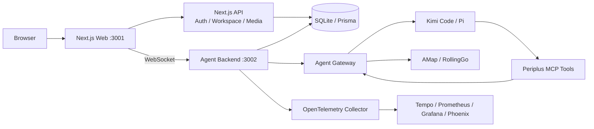

# Periplus

[简体中文](./README.md) · [English](./README.en.md)

> A map-first, event-driven AI travel planning workbench.

Periplus brings maps, itinerary cards, AI conversations, and travel material into one Workspace. People can edit a route directly or ask an Agent to search for places, plan transit, and produce a structured itinerary.

> [!IMPORTANT]
> Periplus is evolving quickly. The repository currently targets local development, product validation, and Agent Harness research; it is not a production deployment blueprint.

## Highlights

- **Map-first planning**: keeps the map, route preview, and event cards synchronized.
- **Unified journey-event model**: cities, places, hotels, meals, activities, and transit share one versioned representation.
- **AI-assisted planning**: supports Kimi Code and Pi runtimes with a constrained set of tools for place, hotel, transit, and itinerary changes.
- **Recoverable Workspaces**: persists conversations, Agent Runs, search results, and journey state so historical sessions can be reopened.
- **Engineering observability**: includes OpenTelemetry, Grafana, Phoenix, and Agent capability smoke checks.

## Architecture



| Component      | Responsibility                                                        |
| -------------- | --------------------------------------------------------------------- |
| Next.js Web    | UI, map workbench, authentication, and product APIs                   |
| Agent Backend  | WebSocket, Agent lifecycle, streamed messages, and tool entry point   |
| Agent Runtime  | Runs Kimi Code or Pi with explicitly allowed Periplus tools           |
| Data Layer     | Stores Journeys, Workspaces, messages, and content with Prisma/SQLite |
| Provider Layer | Integrates AMap map/place/transit services and RollingGo hotels       |
| Observability  | Collects traces, metrics, and redacted Agent telemetry                |

## Technology

| Layer         | Main technologies                                         |
| ------------- | --------------------------------------------------------- |
| Web           | Next.js 16, React 19, TypeScript, Tailwind CSS 4, Zustand |
| Maps          | AMap JS API and Web Service API                           |
| Backend       | Node.js, HTTP/WebSocket, Zod, MCP SDK                     |
| Agent         | Kimi Code, Pi Coding Agent, DeepSeek                      |
| Data          | SQLite, Prisma, Better Auth                               |
| Testing       | Vitest, Storybook, Playwright                             |
| Observability | OpenTelemetry, Tempo, Prometheus, Grafana, Phoenix        |

## Quick start

### Requirements

- Node.js 22 and npm are recommended.
- Maps and place search require an AMap JS API key and Web Service key.
- AI planning requires a configured Kimi Code installation or Pi with DeepSeek API access.
- Hotel search requires a RollingGo API key.
- The complete monitoring stack requires Docker/Compose.

### Install and run

```bash
git clone git@github.com:ykfnxx/periplus.git
cd periplus
npm ci
cp .env.example .env.local
```

Edit `.env.local` and replace its placeholders. To start only the product UI and backend, observability can be disabled:

```dotenv
PERIPLUS_OBSERVABILITY_ENABLED="false"
```

Initialize a fresh local database:

```bash
npx prisma generate
npx prisma migrate deploy
npm run db:seed
```

`npm run db:seed` only accepts an empty database. Do not run it against an existing database.

Start the Web app and Backend:

```bash
npm run dev
```

| Service       | Default URL             |
| ------------- | ----------------------- |
| Product UI    | <http://localhost:3001> |
| Agent Backend | <http://127.0.0.1:3002> |
| Storybook     | <http://localhost:6006> |
| Grafana       | <http://127.0.0.1:3003> |
| Phoenix       | <http://127.0.0.1:6008> |

## Configuration

See [`.env.example`](./.env.example) for the complete configuration template:

- `NEXT_PUBLIC_*`: browser-visible product, backend, and AMap JS API settings.
- `PERIPLUS_AMAP_*` / `PERIPLUS_ROLLINGGO_*`: server-side place, transit, and hotel providers.
- `PERIPLUS_AGENT_RUNTIME` and Kimi/Pi/DeepSeek variables: Agent runtime.
- `BETTER_AUTH_SECRET` / `DATABASE_URL`: authentication and database.
- `PERIPLUS_OBSERVABILITY_*` / `OTEL_*`: observability.

`.env` and `.env.local` are ignored by Git. Never place real API keys, model credentials, authentication secrets, or private network addresses in source code, READMEs, commits, or PRs.

## Commands

| Command                             | Purpose                                     |
| ----------------------------------- | ------------------------------------------- |
| `npm run dev`                       | Start Web and Backend together              |
| `npm run dev:web`                   | Start only the Next.js Web app              |
| `npm run dev:backend`               | Start only the Agent Backend                |
| `npm run storybook`                 | Start the component-development environment |
| `npm run typecheck`                 | Run TypeScript checks                       |
| `npm run lint`                      | Run ESLint                                  |
| `npm run test:unit -- --run`        | Run unit tests once                         |
| `npm run test:e2e`                  | Run Playwright end-to-end tests             |
| `npm run build`                     | Build the production application            |
| `npm run eval:agent:smoke`          | Run Agent capability smoke checks           |
| `npm run observability:up` / `down` | Start or stop the monitoring stack          |

## Repository layout

```text
app/                    Next.js pages and Route Handlers
backend/                Agent Backend, runtimes, MCP, and OTel
components/             Shared UI components
modules/                auth, data, map, workbench, workspace
ops/observability/      Local monitoring stack
prisma/                 Schema, migrations, and local seed
scripts/                Development, evaluation, and operations scripts
tests/                  Unit, Storybook, map integration, and E2E tests
```

Additional documentation:

- [Observability](./ops/observability/README.md)
- [Agent capability evaluation](./backend/agent/evals/README.md)
- [Database schema](./prisma/schema.prisma)

## License

[MIT](./LICENSE) © 2026 ykfnxx
