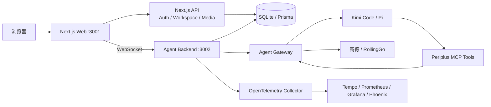

# Periplus

[简体中文](./README.md) · [English](./README.en.md)

> 地图优先、事件驱动的 AI 旅行规划工作台。

Periplus 把地图、行程卡片、AI 对话与旅行资料放进同一个 Workspace。用户可以直接编辑路线，也可以让 Agent 搜索地点、规划交通并生成结构化行程。

> [!IMPORTANT]
> 项目仍在快速迭代阶段，当前仓库主要用于本地开发、产品验证与 Agent Harness 研究，不应直接视为生产部署方案。

## 核心能力

- **地图优先的规划体验**：地图、路线预览与事件卡片保持联动。
- **统一的旅程事件模型**：城市、景点、酒店、餐饮、活动和交通使用同一套可版本化数据表达。
- **AI 辅助规划**：支持 Kimi Code 与 Pi 运行时，通过受约束的工具完成地点、酒店、交通与行程修改。
- **可恢复的 Workspace**：持久化对话、Agent Run、搜索结果和行程状态，支持重新打开历史会话。
- **完整的工程观测**：提供 OpenTelemetry、Grafana、Phoenix 以及 Agent capability smoke。

## 整体架构



| 组件           | 职责                                                   |
| -------------- | ------------------------------------------------------ |
| Next.js Web    | 页面、地图工作台、登录与产品 API                       |
| Agent Backend  | WebSocket、Agent 生命周期、流式消息与工具入口          |
| Agent Runtime  | 运行 Kimi Code 或 Pi，调用显式允许的 Periplus 工具     |
| Data Layer     | 使用 Prisma/SQLite 保存 Journey、Workspace、消息与资料 |
| Provider Layer | 对接高德地图、地点/交通能力与 RollingGo 酒店服务       |
| Observability  | 采集 trace、metrics 与经过脱敏的 Agent 观测数据        |

## 技术栈

| 层       | 主要技术                                                  |
| -------- | --------------------------------------------------------- |
| Web      | Next.js 16、React 19、TypeScript、Tailwind CSS 4、Zustand |
| 地图     | 高德 JS API、Web Service API                              |
| 后端     | Node.js、HTTP/WebSocket、Zod、MCP SDK                     |
| Agent    | Kimi Code、Pi Coding Agent、DeepSeek                      |
| 数据     | SQLite、Prisma、Better Auth                               |
| 测试     | Vitest、Storybook、Playwright                             |
| 可观测性 | OpenTelemetry、Tempo、Prometheus、Grafana、Phoenix        |

## 快速开始

### 环境要求

- 建议使用 Node.js 22 与 npm。
- 地图与地点查询需要高德 JS API Key 和 Web Service Key。
- AI 规划需要已配置的 Kimi Code，或 Pi + DeepSeek API。
- 酒店查询需要 RollingGo API Key。
- 完整监控栈需要 Docker/Compose。

### 安装与启动

```bash
git clone git@github.com:ykfnxx/periplus.git
cd periplus
npm ci
cp .env.example .env.local
```

编辑 `.env.local` 并替换占位值。只想先启动产品界面时，可以设置：

```dotenv
PERIPLUS_OBSERVABILITY_ENABLED="false"
```

初始化一个全新的本地数据库：

```bash
npx prisma generate
npx prisma migrate deploy
npm run db:seed
```

`npm run db:seed` 只接受空数据库，不要对已有数据的数据库执行。

启动前后端：

```bash
npm run dev
```

| 服务          | 默认地址                |
| ------------- | ----------------------- |
| 产品页面      | <http://localhost:3001> |
| Agent Backend | <http://127.0.0.1:3002> |
| Storybook     | <http://localhost:6006> |
| Grafana       | <http://127.0.0.1:3003> |
| Phoenix       | <http://127.0.0.1:6008> |

## 配置

完整配置模板见 [`.env.example`](./.env.example)：

- `NEXT_PUBLIC_*`：浏览器可见的产品、后端与高德 JS API 配置。
- `PERIPLUS_AMAP_*` / `PERIPLUS_ROLLINGGO_*`：服务端地点、交通与酒店 provider。
- `PERIPLUS_AGENT_RUNTIME` 与 Kimi/Pi/DeepSeek 变量：Agent 运行时。
- `BETTER_AUTH_SECRET` / `DATABASE_URL`：认证与数据库。
- `PERIPLUS_OBSERVABILITY_*` / `OTEL_*`：可观测性。

`.env` 与 `.env.local` 已被 Git 忽略。不要在源码、README、commit 或 PR 中写入真实 Key、模型凭据、认证 secret 或内网地址。

## 常用命令

| 命令                                | 用途                        |
| ----------------------------------- | --------------------------- |
| `npm run dev`                       | 同时启动 Web 与 Backend     |
| `npm run dev:web`                   | 只启动 Next.js Web          |
| `npm run dev:backend`               | 只启动 Agent Backend        |
| `npm run storybook`                 | 启动组件开发环境            |
| `npm run typecheck`                 | TypeScript 检查             |
| `npm run lint`                      | ESLint 检查                 |
| `npm run test:unit -- --run`        | 单次运行 unit tests         |
| `npm run test:e2e`                  | 运行 Playwright E2E         |
| `npm run build`                     | 构建生产版应用              |
| `npm run eval:agent:smoke`          | 运行 Agent capability smoke |
| `npm run observability:up` / `down` | 启动/停止监控栈             |

## 项目结构

```text
app/                    Next.js 页面与 Route Handlers
backend/                Agent Backend、runtime、MCP 与 OTel
components/             通用 UI 组件
modules/                auth、data、map、workbench、workspace
ops/observability/      本地监控栈
prisma/                 schema、迁移与本地 seed
scripts/                开发、评估与运维脚本
tests/                  unit、Storybook、map integration 与 E2E
```

更多说明：

- [可观测性](./ops/observability/README.md)
- [Agent capability evaluation](./backend/agent/evals/README.md)
- [数据库结构](./prisma/schema.prisma)

## License

[MIT](./LICENSE) © 2026 ykfnxx
